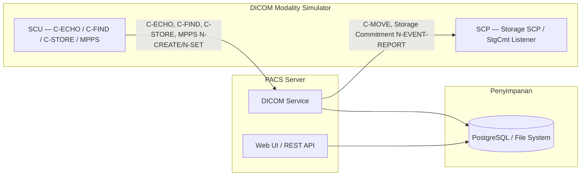

# DICOM Modality Simulator

Aplikasi desktop Linux untuk simulasi perangkat modality DICOM (CT, MRI, X-ray, USG console). Digunakan untuk testing integrasi PACS tanpa perlu modality sungguhan.

Dibuat dengan **Python/Tkinter** + **pynetdicom** + **pydicom**.

---

## Fitur

| Kategori | Fitur | Status |
|----------|-------|--------|
| Koneksi | C-ECHO — Test koneksi ke PACS | ✅ |
| Koneksi | C-FIND — Ambil worklist / daftar study | ✅ |
| Koneksi | C-STORE — Kirim file DICOM ke PACS | ✅ |
| Koneksi | C-MOVE — Retrieve study dari PACS | 🚧 |
| Storage | Storage SCP — Terima file dari PACS / modality lain | ✅ |
| Storage | JPG/PNG → DICOM — Convert gambar ke Secondary Capture | ✅ |
| Workflow | MPPS — N-CREATE / N-SET (IN PROGRESS → COMPLETED) | 🚧 |
| Workflow | Storage Commitment — Konfirmasi penyimpanan dari PACS | 🚧 |
| Utilitas | Dataset Viewer — Lihat isi tag DICOM sebelum kirim | ✅ |
| Utilitas | DICOM Log — Semua aktivitas tercatat di panel log | ✅ |

**Keterangan:** ✅ Working · 🚧 Partial · 📋 Planned

---

## Screenshot

(Lihat folder `screenshots/` atau jalankan `python main.py`)

---

## Arsitektur



**Penjelasan:** Simulator bertindak sebagai modality (CT/MRI/USG console) yang mengirim request DICOM ke PACS. PACS menyimpan data dan bisa mengirim balik ke SCP simulator.

---

## Kompatibilitas PACS

| PACS Server | Status | Catatan |
|-------------|--------|---------|
| dcm4chee-arc 5.x | ✅ Teruji | Semua fitur work dengan LDAP + Web UI |
| Orthanc | ✅ Kompatibel | DICOM standard, tidak perlu LDAP |
| DCMTK storescp | ✅ Kompatibel | Storage SCP sederhana |
| Conquest DICOM Server | 🚧 Perlu verifikasi | Belum diuji langsung |

---

## Requirements

- Python 3.10+
- Linux (X11/Wayland) — bisa juga di WSL2 dengan X server
- PACS Server (dcm4chee / Orthanc / Conquest) untuk testing penuh

### Dependencies

| Library | Versi | Fungsi |
|---------|-------|--------|
| pynetdicom | ≥2.0 | DICOM networking (SCU/SCP) |
| pydicom | ≥3.0 | Baca/tulis dataset DICOM |
| Pillow | ≥10.0 | Konversi gambar ke DICOM |

---

## Instalasi

```bash
# Clone
git clone https://github.com/adptra01/dicom-modality-simulator.git
cd dicom-modality-simulator

# Virtual env
python3 -m venv .venv
source .venv/bin/activate

# Install
pip install pynetdicom pydicom Pillow

# Jalankan
python main.py
```

---

## Konfigurasi

File `config.json` di root proyek:

```json
{
  "ae_title": "SIMULATOR",
  "called_ae": "DCM4CHEE",
  "pacs_host": "192.168.1.100",
  "pacs_port": 11112,
  "calling_ae": "SIMULATOR",
  "scp_ae": "SIMULATOR-SCP",
  "scp_port": 11113
}
```

| Field | Default | Fungsi |
|-------|---------|--------|
| `ae_title` | SIMULATOR | Nama aplikasi kita di jaringan DICOM (SCU) |
| `called_ae` | DCM4CHEE | Nama PACS tujuan |
| `pacs_host` | localhost | Alamat IP PACS |
| `pacs_port` | 11112 | Port DICOM PACS |
| `calling_ae` | SIMULATOR | AE Title yang dipakai saat konek (biasanya sama dg ae_title) |
| `scp_ae` | SIMULATOR-SCP | AE Title untuk SCP server (C-MOVE/Storage Commitment) |
| `scp_port` | 11113 | Port untuk SCP server |

Bisa diubah lewat GUI (isi field + klik Save) atau edit file langsung.

---

## Quick Start ⭐

### Sebelum Memulai

Pastikan 4 hal ini sudah siap:

1. **PACS server berjalan** — dcm4chee, Orthanc, atau server DICOM lain
2. **AE Title simulator sudah terdaftar** — terutama untuk PACS yang memerlukan registrasi (dcm4chee: lihat [Panduan Integrasi](docs/DCM4CHEE-Integration.md))
3. **Port PACS (11112) bisa diakses** — tes: `telnet <host-pacs> 11112`
4. **Ada file DICOM `.dcm` untuk dikirim** — contoh dari PACS atau [DICOM samples](https://github.com/ImagingDataCommons/dicom-examples)

### Langkah

Cuma 6 langkah, selesai 2 menit:

```
1. Jalankan: python main.py
         ↓
2. Test Connection — isi Host/Port PACS, klik [Test Connection]
         ↓
3. Refresh Worklist — klik [Refresh Worklist]
         ↓
4. Pilih pasien — klik salah satu baris di tabel
         ↓
5. Browse DICOM — klik [Browse DICOM...], pilih file .dcm
         ↓
6. Send — klik [Send to PACS]
```

Kalau semua berhasil, panel log akan menampilkan:

```
● Connected to DCM4CHEE@192.168.1.100:11112
Worklist: 4 items
Selected: KNIX^KNIX (KNIX)
C-STORE Success
```

---

## Roadmap

| Versi | Isi |
|-------|-----|
| v0.1 | C-ECHO, C-STORE |
| v0.2 | C-FIND Worklist + tabel |
| v0.3 | Auto-fill patient info |
| v0.4 | JPG/PNG → DICOM |
| v0.5 | Storage SCP |
| v1.0 | MPPS, Storage Commitment, C-MOVE |
| v1.1 | Cancel, timeout, graceful close |
| v1.2 | C-GET retrieve |
| v1.3 | Modality Worklist (MWL) |
| v2.0 | Config UI (preferences dialog) |

---

## Lisensi

MIT

---

## Acknowledgements

- [pynetdicom](https://github.com/pydicom/pynetdicom) — DICOM networking library
- [pydicom](https://github.com/pydicom/pydicom) — DICOM file format library
- [dcm4chee-arc-light](https://github.com/dcm4che/dcm4chee-arc-light) — PACS server untuk testing
- [DCMTK](https://dicom.offis.de/dcmtk/) — DICOM toolkit (referensi)
